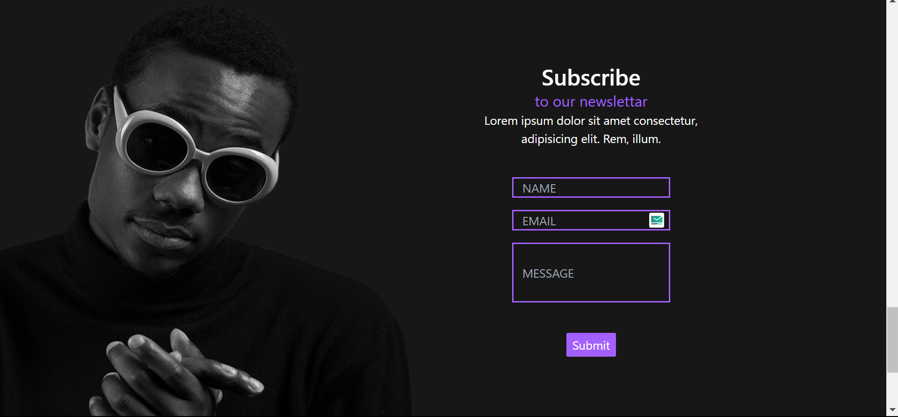

# React Home Page - Day 3 of 100 Days Coding Challenge





## Welcome to my 100 Days of Code challenge! 🚀

This project marks Day 3, where I've built a simple React home page as a part of my journey to improve as a full-stack developer.

### Description

This project represents the initial step in my 100-day challenge, focusing on mastering React and improving my front-end development skills. The goal of today's work was to create a basic, responsive home page using React components and JSX.

### Features

- **React Components:** Utilized React's component-based architecture to create a modular and maintainable structure.
- **Basic Styling:** Added minimal styling to the home page using Tailwind CSS and/or styled-components.

### Technologies Used

- React
- Tailwind CSS

### Getting Started

1. **Clone the Repository:**

```bash
  git clone https://github.com/shivamsheokand/Day-3.git
```

Install Dependencies:

```bash
cd Day-3
npm install
```

Run the App:

```bash

npm start
```

View the App:

Open your browser and go to http://localhost:3000 to see the React home page.

Project Structure

```css
Copy code
├── public/
│   ├── index.html
│   └── ...
├── src/
│   ├── assets/
│   ├── Pages/
│   │   ├── Home.js
│   │   └── ...
│   ├── App.js
│   ├── index.js
│   └── ...
└── ...
```

# Future Steps

Enhanced Functionality: Implement additional features like navigation, dynamic content, or interactive elements.
Refinement: Improve code quality, adhere to best practices, and apply more sophisticated styling.
This README serves as documentation for my progress on Day 3. I'm excited to continue this journey and build upon this foundation over the next 99 days!

Happy Coding! 🌟

```css


Feel free to further customize it to include any additional information or details specific to your project!
```
